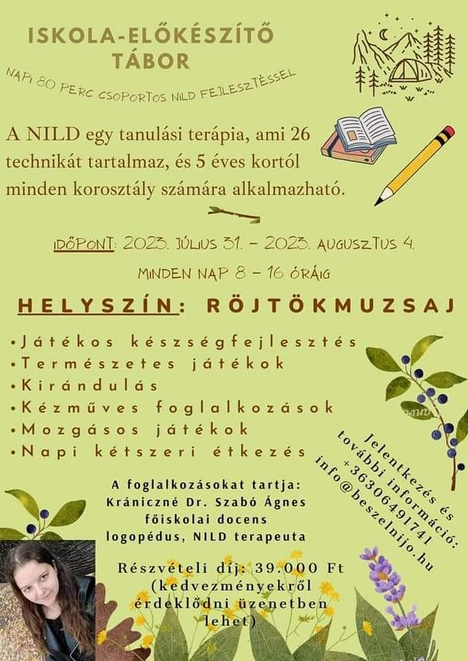

**<u>Időpont:</u>** 2023\. július 31. – 2023. augusztus 4. Minden nap 8-16 óráig

Röjtökmuzsajon a Közösségi házban (a templom melletti zöld épület)

**<u>A napirend a következőképpen alakul:</u>**

8.00 – 9.00 Indul a nap! Torna, nagymozgásos játékok.

9.00 – 9.20 Reggeli

9.30 – 11.00 Csoportos NILD fejlesztés

11.00 – 13.00 Séta, ebéd

13.00 – 14.30 Kézműves foglalkozás

14.30 – 15.00 Uzsonna elkészítése közösen

15.00 – 16.00 Játék

Kérjük, hogy az uzsonnához **minden nap 1-2 gyümölcsöt** biztosítsanak a
gyermek számára!

**<u>Kézműves foglalkozások</u>**: fa figura festése, kosárfonás
(szappantartó készítése), kavicsfestés, spatula-kép készítése, saját
textilszatyor készítése.

Jó idő esetén a reggeli torna helyett kirándulással indítjuk a napot!

